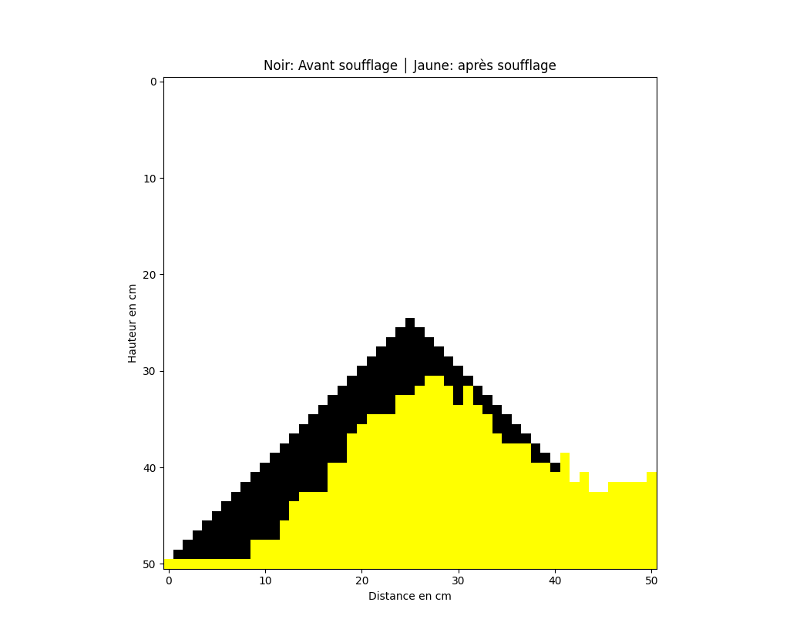
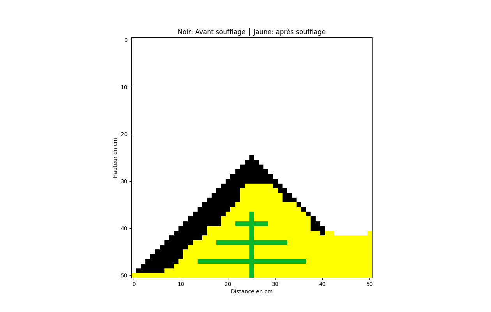

Projet réalisé dans le cadre d'un **TIPE** (Travail d'Initiative Personnelle
Encadré).
---
## À propos

Ce projet est né d'une réflexion sur l'application du biomimétisme pour
protéger les dunes face à l'érosion éolienne. Les réseaux racinaires des
végétaux stabilisent naturellement le sable. Nous avons cherché à savoir si
des racines artificielles pouvaient remplir le même rôle. Afin de tester cette
hypothèse, nous avons mis en place une simulation informatique simple. Elle
modélise la dune sous forme de matrice et applique des règles probabilistes de
déplacement des grains de sable.

Le code a été conçu étape par étape en Python. Après avoir modélisé la dune et
ses racines potentielles, nous avons introduit des fonctions pour gérer le vent,
la gravité et l'affichage. Les bibliothèques `numpy`, `scipy` et `matplotlib`
nous ont permis d'implémenter rapidement les calculs et la visualisation.
Au fil des essais, nous avons ajusté les paramètres et structuré le code pour
comparer facilement l'effet de racines naturelles ou artificielles sur la
dispersion du sable.
## Objectif du TIPE

L'objectif était de comparer la dynamique d'une dune nue avec celle d'une dune
stabilisée par des plantes par rapport à la érosion de la dune due au vent. 
Ce modèle numérique reposant sur des règles simples
et un calcul probabiliste permet de visualiser l'impact des racines sur la
retenue des grains de sable.


# Modélisation de la dispersion d'une dune de sable

Ce projet de TIPE modélise l'évolution d'une dune sous l'effet du vent. La dune
est représentée par une matrice de caractères où `■` symbolise un grain de sable
et l'espace `' '` une case vide. Pour étudier l'influence des végétaux, des
racines peuvent être ajoutées dans la matrice (symboles `│` et `─`).

## Installation

Le code fonctionne avec **Python 3** et nécessite les bibliothèques
`numpy`, `matplotlib` et `scipy` :

```bash
pip install numpy matplotlib scipy
```

## Principales fonctions

- `pyramide(n)` crée la dune initiale (sans végétation) de taille `n × n`.
- `pyramide_racines(n, x)` construit la même dune en y ajoutant des racines de
  hauteur contrôlée par `x`.
- `dune_simulation(n, tour, temps)` lance une simulation sans plantes.
- `dune_simulation_racines(n, x, tour, temps)` exécute la version avec
  racines.
- `image(n, tour)` et `image_bis(n, x, tour)` produisent une image *matplotlib*
  comparant la dune avant et après diffusion.
- `profil_lissé(hauteurs_à_vide, hauteurs_après_soufflage, d1, d2, nom)` trace
  des profils expérimentaux lissés par interpolation polynomiale pour comparaison.

Les fonctions `check_zeros` et `check_zeros_2` évaluent l'exposition d'un grain
(nombre de voisins vides) et détectent la présence éventuelle de racines. Cette
information est utilisée par `proba`, qui calcule la probabilité de déplacement
de chaque grain. `gravity` fait ensuite retomber les grains isolés pour éviter
qu'ils ne "flottent" dans la matrice.

## Lancer une simulation

Exemple : pour simuler 10 tours sur une dune de 51 cases de côté sans végétaux
et afficher l'évolution toutes les 0,8 secondes :

```python
from main import dune_simulation

dune_simulation(51, 10, 0.8)
```

Les paramètres `tour` (nombre d'itérations) et `temps` (pause entre chaque tour)
permettent d'observer progressivement la dispersion des grains.

## Illustrations

Illustration du profil d'une dune sans végétation avant et après diffusion :



Illustration de la dune stabilisée par des racines :


